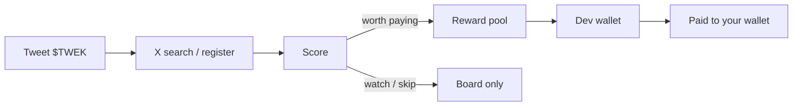

<p align="center">
  
</p>

<h1 align="center">TWEK</h1>

<p align="center">
  <strong>Post <code>$TWEK</code>. Get scored. Get paid.</strong><br />
  A public bounty on a cashtag — original tweets take a slice of a live dollar pool.
</p>

<p align="center">
  <a href="https://x.com/Twek_App"></a>
  
  
  
  
</p>

---

## What it is

TWEK is a tweet-to-earn app on Solana. People connect a wallet, tweet the cashtag **`$TWEK`**, and a scorer decides if that post is worth a share of this hour’s pool. Dollars leave the **Dev wallet**. There is no treasury hop, no form, no referral code.

The tweet is the claim ticket. The linked Solana wallet is where the money lands. X is only how we match the author.

| | |
| --- | --- |
| **Ticker** | `$TWEK` |
| **Official X** | [@Twek_App](https://x.com/Twek_App) |
| **Contract** | [`3WUztmmgYpJQATczBBaqwNxdFoUQXkoTraoPGaxBpump`](https://pump.fun/coin/3WUztmmgYpJQATczBBaqwNxdFoUQXkoTraoPGaxBpump) |
| **Chain** | Solana |
| **Min payout** | `$0.50` (dust is skipped) |
| **Hourly pool** | `TWEK_POOL_USD` (default `$50`) |

---

## How a tweet turns into cash



1. Connect a Solana wallet (Phantom, Solflare, or Privy embedded).
2. Link the X account you will tweet from.
3. Post a public tweet that includes `$TWEK`.
4. We store the tweet id once and score it (originality, engagement, recency, trust).
5. Worth-paying posts split this hour’s pool by weight.
6. Dev sends from the Dev wallet, then marks the row paid (tx optional).

On-chain send is **not automatic** yet. Payment records the send. The Dev wallet still does the transfer.

---

## Product surface

| Route | Page | What it does |
| --- | --- | --- |
| `/` | Home | Live bounty, board preview, hourly pool |
| `/explore` | Board | Scored `$TWEK` posts · Dev pull / paste / mark |
| `/earn` | Earn | Compose, post on X, register a status URL |
| `/payouts` | Payment | Pool split · queued / blocked / paid |
| `/flow` | Flow | End-to-end money path |
| `/analytics` | Stats | Live payout table + leaderboard |
| `/docs` | Docs | How scoring and settlement work |

---

## Stack

| Layer | Choice |
| --- | --- |
| App | Vite 8 · React 19 · Tailwind 4 · React Router 7 |
| Auth | [Privy](https://www.privy.io/) — Solana wallets + X |
| API | Node `http` on `:8787`, proxied as `/api` |
| Data | [Supabase](https://supabase.com/) (service role on the server only) |
| X | Official API v2 app-only bearer · recent search `$TWEK` |
| Scoring | Local scorer in `server/score.js` |

Frontend never talks to Supabase. The browser only hits `/api`. RLS is on; `anon` / `authenticated` are revoked.

---

## Scoring

Every tweet gets a **verdict** and a **weight**.

| Verdict | Meaning |
| --- | --- |
| **Worth paying** | Original enough, live engagement — enters the pool |
| **Watch** | Not dust, not a lock. Bot can change this. A Dev mark freezes it. |
| **Skip** | Raid line, no cashtag, empty, or too weak |

Weight (share of the hourly pool):

```text
weight = impressions^0.6 × originality × engagement × recency × trust
payout = pool × (weight / Σ weights of queued tweets)
```

Hard rules:

- No `$TWEK` in the body → skip
- Copy-paste raids and near-duplicates get crushed
- Posts older than ~3 days are for live attention, not archaeology
- Brand-new empty handles rank worse
- Shares under **$0.50** show as dust and are not sent
- Each tweet id is paid **once**

Dev can override Worth paying / Watch / Skip. Watch as an override **sticks** — do not use it as a staging step.

---

## Payouts

Statuses in `payouts`:

| Status | Meaning |
| --- | --- |
| `queued` | Worth paying + wallet linked · waiting for Dev send |
| `blocked` | Worth paying, no wallet on the handle yet |
| `cancelled` | No longer worth paying |
| `sent` | Marked paid after the Dev wallet send |

Wallet bind is first-write-wins. A second wallet cannot overwrite unless Dev is unlocked. Public APIs do not leak wallet addresses.

---

## Local setup

Need **Node 20+**.

```bash
git clone https://github.com/twekapp/twekapp.git
cd twekapp
npm install
cp .env.example .env.local
```

Fill `.env.local`, run the schema in Supabase, then:

```bash
npm run dev
```

That starts the API (`:8787`) and Vite (`:5173`). Open [http://localhost:5173](http://localhost:5173).

| Script | What it runs |
| --- | --- |
| `npm run dev` | API `--watch` + Vite |
| `npm run dev:web` | Vite only |
| `npm run dev:api` | API only |
| `npm run build` | Production frontend |
| `npm run preview` | Serve the build |

---

## Environment

Put secrets in `.env.local`. It is gitignored. Never commit a bearer, service role, or admin key.

### Frontend (Vite)

| Variable | Required | Notes |
| --- | --- | --- |
| `VITE_PRIVY_APP_ID` | yes | Privy dashboard |
| `VITE_PRIVY_CLIENT_ID` | no | Only if you created an app client |

Add `localhost:5173` (and later the real domain) in Privy → allowed origins / redirect URLs.

### Server

| Variable | Required | Notes |
| --- | --- | --- |
| `X_BEARER_TOKEN` | for live X | X developer portal → app → Keys → Bearer. Not the Privy X login. |
| `X_PULL` | yes | `1` = live `$TWEK` pull. `off` = pause (no credit spend). |
| `X_PULL_MAX` | no | Tweets per pull. Minimum 10 (X API). Default `10`. |
| `X_PULL_MINUTES` | no | Auto interval after the first manual pull. Default `30`. |
| `SUPABASE_URL` | yes | Project URL |
| `SUPABASE_SERVICE_ROLE_KEY` | yes | **service_role** secret, not the anon key |
| `TWEK_ADMIN_KEY` | yes | Board + Payment Dev unlock. HMAC cookie, 30 days. |
| `TWEK_POOL_USD` | no | Hourly pool in dollars. Default `50`. |
| `TWEK_COOKIE_SECURE` | prod | Set `1` behind HTTPS (or `NODE_ENV=production`). |
| `API_PORT` | no | Default `8787`. |

Search is **live** (`X_PULL=1`). Pause with `X_PULL=off`. Each pull costs X credits (~$0.005 per tweet read). After the first Pull now, auto-pull runs every `X_PULL_MINUTES` with `since_id` (local Node only).

---

## Supabase

1. Create a project.
2. SQL Editor → paste [`supabase/schema.sql`](supabase/schema.sql) → run.
3. Put `SUPABASE_URL` and `SUPABASE_SERVICE_ROLE_KEY` in `.env.local`.
4. Restart the API.

Tables: `meta`, `users`, `tweets`, `scores`, `payouts`.

RLS is enabled. `anon` and `authenticated` have **no** grants. Only the server service role reads and writes.

---

## Dev tools

On **Board** and **Payment**, unlock with `TWEK_ADMIN_KEY`.

Unlocked, you can:

- Pull now (only if `X_PULL=1`)
- Paste tweet text and score it (free — no X credits)
- Mark Worth paying / Watch / Skip
- Mark payouts paid and attach a tx signature

Everyone else can browse the board and pool. They cannot mark tweets or send payouts.

---

## X search

Query when pull is on:

```text
$TWEK -is:retweet
```

`#TWEK` is **not** used. That hashtag collides with unrelated “twek / twerk” posts and burns credits.

| Mode | Spends X credits? |
| --- | --- |
| Auto / Pull now | Yes |
| Register a status URL | Yes (one tweet lookup) |
| Paste text on Board | No |

---

## HTTP API

Base: `http://localhost:8787` (Vite proxies `/api` in dev).

| Method | Path | Auth | Purpose |
| --- | --- | --- | --- |
| `GET` | `/api/health` | public | Process + DB ping |
| `GET` | `/api/tweets` | public | Scored board (wallets stripped) |
| `POST` | `/api/tweets/refresh` | Dev | Search X |
| `POST` | `/api/tweets/analyze` | Dev | Score pasted text |
| `POST` | `/api/tweets/verdict` | Dev | Override pay / watch / skip |
| `POST` | `/api/tweets/register` | public* | Lookup a status URL (`X_PULL=1`) |
| `GET` | `/api/payouts` | public | Queue (wallets only if Dev cookie) |
| `POST` | `/api/payouts/send` | Dev | Mark paid |
| `POST` | `/api/users/link` | public | Bind handle → Solana wallet (no overwrite) |
| `GET` | `/api/admin/me` | cookie | Dev session |
| `POST` | `/api/admin/unlock` | key | Set Dev cookie |
| `POST` | `/api/admin/lock` | cookie | Clear Dev cookie |

\* Register requires a real `x.com/status/…` URL. It will not guess the tweet from a handle.

---

## Repo map

```text
src/                 React app
  pages/             Home, Board, Earn, Payment, Flow, Stats, Docs
  components/        Layout, logo, cards, Dev gate
  providers/         Privy
server/              Node API, scorer, Supabase, X client
supabase/schema.sql  Tables + RLS + revoke
public/TWEKPFP.jpg   Brand
scripts/dev.mjs      API + Vite together
```

---

## Deploy (Vercel)

The app is set up for [Vercel](https://vercel.com): Vite build + one serverless function for `/api`.

1. Import [twekapp/twekapp](https://github.com/twekapp/twekapp) in Vercel (login as **twekapp**).
2. Framework: Vite. Root: repo root. Build: `npm run build`. Output: `dist`.
3. **Settings → Environment Variables** (Production). Do **not** prefix server secrets with `VITE_`.

| Name | Value |
| --- | --- |
| `VITE_PRIVY_APP_ID` | Privy app id |
| `X_PULL` | `1` |
| `X_PULL_MAX` | `10` |
| `X_PULL_MINUTES` | `30` |
| `X_BEARER_TOKEN` | X bearer |
| `SUPABASE_URL` | Project URL |
| `SUPABASE_SERVICE_ROLE_KEY` | service_role only |
| `TWEK_ADMIN_KEY` | same Dev key as local |
| `TWEK_POOL_USD` | `50` |
| `TWEK_COOKIE_SECURE` | `1` |
| `NODE_ENV` | `production` (Vercel sets this) |

4. Deploy. Open `/api/health` — expect `"db":"supabase"`.
5. Privy → add the Vercel domain (`*.vercel.app` and later the real domain) to allowed origins / redirect URLs.
6. Contract is already in `CONFIG.ca`. Search is live (`X_PULL=1`). Pause with `X_PULL=off`.

Vercel has **no always-on timer**. Auto X pull every 30 minutes does not run there. Pull now still works; add a Vercel Cron later if you want the interval.

Suggested go-live order: **host → token + CA → one official `$TWEK` tweet from [@Twek_App](https://x.com/Twek_App) → `X_PULL=1` → one Pull now → pay the first row by hand**.

---

## Status

| Piece | State |
| --- | --- |
| UI + wallet connect | Ready |
| Board + scorer + Supabase | Ready |
| X search | **Live** (`X_PULL=1`). Pause with `off`. |
| Payment split + Mark paid | Ready |
| Automatic on-chain send | Not built |
| Contract address | `3WUztmmgYpJQATczBBaqwNxdFoUQXkoTraoPGaxBpump` |

---

## Disclaimer

TWEK is a promotional bounty on a cashtag. It is not an offer of securities and is not affiliated with X Corp. Rewards can change or stop. Do not farm with bots, bought impressions, or inauthentic engagement. Fake tweets are not paid.

---

<p align="center">
  <a href="https://x.com/Twek_App">@Twek_App</a>
  · © 2026 TWEK
</p>
